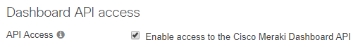
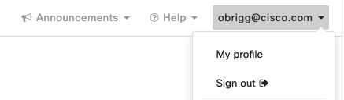

# Meraki Rogue Investigator

### The Challenge

The Meraki dashboard is amazing, but (at the moment) locating rogue APs and SSIDs is not very user-friendly.
The dashboard aggregates BSSIDs under the same SSID making it hard to get an idea for the location of each BSSID.

### The Solution

This script will use the Meraki API to query all rogue BSSIDs on a given Meraki network, and return detailed information for any given BSSID.

### How to run the script:

#### Installation

1. Clone the repo
```console
git clone https://github.com/obrigg/meraki-rogue-investigator.git
```


2. cd into directory
```console
cd meraki-rogue-investigator
```
3. Create the virtual environment in a sub dir in the same directory
```console
python3 -m venv venv
```
4. Start the virtual environment and install requirements.txt from the <fmc_find_nat_rules>
```console
source venv/bin/activate
pip install -r requirements.txt
```

#### Generate your Meraki API Key

1. Access the [Meraki dashboard](dashboard.meraki.com).
2. For access to the API, first enable the API for your organization under Organization > Settings > Dashboard API access.
<p align="center"></p>
3. After enabling the API, go to "my profile" on the upper right side of the dashboard to generate an API key. This API key will be associated with the Dashboard Administrator account which generates it, and will inherit the same permissions as that account.  You can generate, revoke, and regenerate your API key on your profile.
<p align="center"></p>
<p align="center"></p>
**Always keep your API key safe as it provides authentication to all of your organizations with the API enabled. If your API key is shared, you can regenerate your API key at any time. This will revoke the existing API key.**

#### Storing the Meraki API Key as an environment variable
Once the API key is obtained, you'll need to store the Meraki dashboard API key as an environment variable:
```console
export MERAKI_KEY = <YOUR MERAKI API KEY>
```

Now you're ready. Good luck!
```console
python run.py
```


----
### Licensing info
Copyright (c) 2020 Cisco and/or its affiliates.

This software is licensed to you under the terms of the Cisco Sample
Code License, Version 1.1 (the "License"). You may obtain a copy of the
License at

               https://developer.cisco.com/docs/licenses

All use of the material herein must be in accordance with the terms of
the License. All rights not expressly granted by the License are
reserved. Unless required by applicable law or agreed to separately in
writing, software distributed under the License is distributed on an "AS
IS" BASIS, WITHOUT WARRANTIES OR CONDITIONS OF ANY KIND, either express
or implied.
